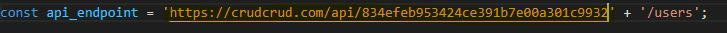

# Lexart ABM

# Task
1.  Crear un WebApp en JavaScript (puede ser con Vue, AngularJS, ReactJS, Vanilla) que integre un ABM de Clientes
    

1.  Modelo de datos : Cliente: (_id, nombre, apellido, rut, tipo [empresa, consumidor final], telefono, activo)
    
2.  Crear un formulario para registrar un cliente con el modelo de datos anterior.
    

1.  Listar los ítems en una tabla
    

1.  Cada ítem tendrá dos acciones: “Select”, “Delete”
    

4.  “Select”: Obtenga el item por medio de un GET por _id y cargue los datos en el formulario.
    
5.  Editar el item de cliente.
    

3.  Utilice el servicio [crudcrud.com](https://crudcrud.com/) para guardar las interacciones del ABM.
    
4.  Cargar todo el código del proyecto en un repositorio público de github.

## Guía de instalación

 1. Descargar el repositorio.

2. Ejecutar el comando `npm install` en la carpeta del repositorio.

3. Ejecutar el comando `npm start` (esto abrirá una venta en el navegador con la app funcionando).

4. 

5. Refrescar la página de la app, y listo!

## Notas

Salvo la parte de editar quedó todo en funcionamiento. Ya que es de mis primeros proyectos en reactJS se me dificulto en el tiempo dado encontrar una solución para obtener poner los elementos en el formulario y editarlos. Por lo tanto el botón SELECT de momento solo carga la información del cliente en el formulario (pero no se puede editar).
